<h3><code>satya@github ~ $ whoami</code></h3>
<table>
  <tr>
    <td valign="top"></td>
    <td valign="top"></td>
  </tr>
</table>

  

<h3><code>satya@github ~ $ ./contributions.sh</code></h3>

---

## 🙋‍♂️ About Me

- 🎓 B.Tech Computer Science Engineering (2023 – 2027)
- 🌱 Currently learning **Machine Learning, Generative AI, FastAPI & System Design**
- 💼 Preparing for **Software Engineering & Product-Based Company interviews**
- 🤖 Passionate about **AI, backend development, and intelligent systems**
- 🧠 Strong foundation in **Java, Python, Data Structures & Algorithms**
- 📫 Reach me at **satyaprakashrout435@gmail.com**

---

## 🚀 Featured Projects

| Project | Description | Stack |
|---|---|---|
| 🩺 **[Project CURA](https://github.com/SatyaPrakash252/Agent-CURA)** | Agentic clinical documentation platform | FastAPI, Next.js, Groq, JWT, Docker, AI Agents |
| 🌱 **Plant Health Detection** | CNN-based plant disease detection | TensorFlow, OpenCV |
| 🎬 **[Movie Portal](https://github.com/SatyaPrakash252/movie-portal-flask)** | Netflix-style movie platform | Flask, SQLite, TMDB API |
| 🏏 **Cricket Performance Prediction** | ML pipeline with an interactive dashboard | Scikit-learn, Streamlit |

---

## 🛠 Languages & Technologies

 
 

---

## 🌐 Connect With Me

<!-- ⚠️ this currently points to a LinkedIn profile named "likuna-swain",
     which doesn't match your name — swap in your own LinkedIn URL. -->

---

*"I enjoy turning ideas into real-world software and explaining complex concepts in a simple way."*

⭐ Thanks for visiting my profile!

